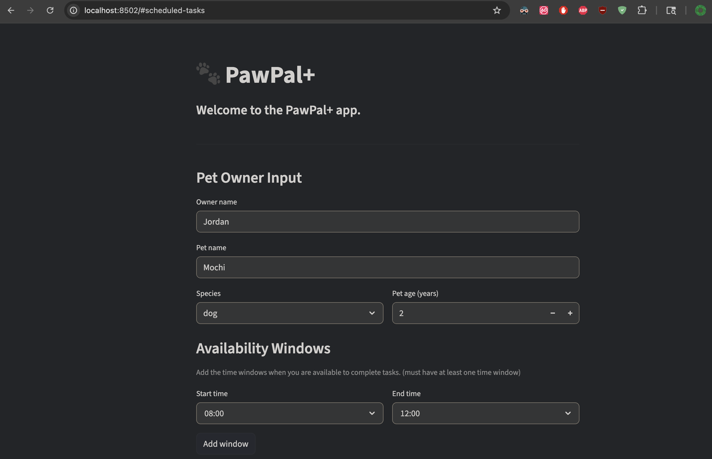

# PawPal+ (Module 2 Project)

## DEMO


## Getting started

### Setup

```bash
python -m venv .venv
source .venv/bin/activate  # Windows: .venv\Scripts\activate
pip install -r requirements.txt
```

# Testing PawPal+
```bash
python3 -m pytest
```

Confidence Level - 4 stars

## Features

### Pet & Owner Setup
- Enter owner name, pet name, species (dog, cat, rabbit, bird, reptile, other), and age
- Add multiple availability windows with custom start/end times
- Remove individual windows with a per-window delete button
- Set a daily max activity limit (30–480 minutes)
- Input validation: start must be before end; at least one window required before scheduling

### Task Management
- Add pet care tasks with a title, duration (1–240 min), and priority (low / medium / high)
- Tasks are displayed in a table as they are added
- High-priority tasks are automatically marked mandatory

### Smart Scheduling
- Generates a conflict-free daily schedule based on owner availability, pet rest blocks, and quiet hours set by owner
- Tasks are scored and ordered by a weighted formula (priority × 0.5 + urgency × 0.3 + preference match × 0.2)
- Higher-priority and overdue tasks are placed first
- Tasks are packed sequentially within windows — no gaps or double-booking
- Supports multiple availability windows across the day
- Tasks too long to fit in any window are reported with a "Could not place" note

### Schedule Display
- Scheduled tasks shown in a chronological table (time, task, duration, priority, reason)
- Notes section explains scheduling decisions and warnings
- Warning shown when total scheduled time exceeds the max activity limit

### Task Completion
- Checklist below the schedule table to mark tasks complete one at a time
- Checking a task immediately regenerates the schedule, removing it from the table
- Completed tasks are excluded from future schedule runs
- Green success banner appears when all scheduled tasks are done

### Summary
- Total minutes scheduled for the day
- Mandatory tasks listed by name with count
- Optional tasks listed by name with count

### Terminal Demo (`main.py`)
- Creates an owner with three pets (dog, cat, rabbit), each with three tasks
- Prints a formatted "Today's Schedule" to the terminal per pet
- Shows task times, names, and mandatory/optional labels


<!-- ## Scenario

A busy pet owner needs help staying consistent with pet care. They want an assistant that can:

- Track pet care tasks (walks, feeding, meds, enrichment, grooming, etc.)
- Consider constraints (time available, priority, owner preferences)
- Produce a daily plan and explain why it chose that plan

Your job is to design the system first (UML), then implement the logic in Python, then connect it to the Streamlit UI.

## What you will build

Your final app should:

- Let a user enter basic owner + pet info
- Let a user add/edit tasks (duration + priority at minimum)
- Generate a daily schedule/plan based on constraints and priorities
- Display the plan clearly (and ideally explain the reasoning)
- Include tests for the most important scheduling behaviors

### Suggested workflow

1. Read the scenario carefully and identify requirements and edge cases.
2. Draft a UML diagram (classes, attributes, methods, relationships).
3. Convert UML into Python class stubs (no logic yet).
4. Implement scheduling logic in small increments.
5. Add tests to verify key behaviors.
6. Connect your logic to the Streamlit UI in `app.py`.
7. Refine UML so it matches what you actually built. -->
