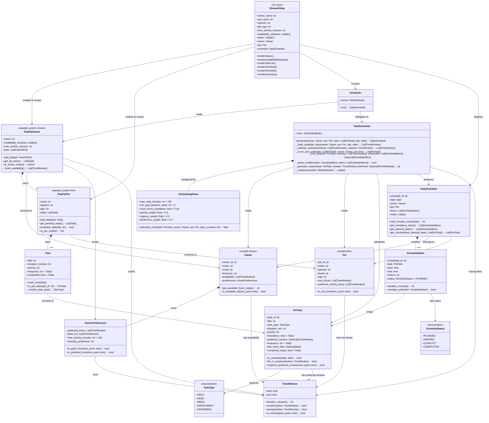

# PawPal+ UML Design

```mermaid
classDiagram
    %% =========================================================
    %% LAYER 1 — UI (app.py)
    %% =========================================================

    class StreamlitApp {
        <<UI Layer>>
        +owner_name: str
        +pet_name: str
        +species: str
        +pet_age: int
        +max_activity_minutes: int
        +availability_windows: List[dict]
        +tasks: List[dict]
        +owner: Owner
        +pet: Pet
        +schedule: DailySchedule
        +renderInputs()
        +renderAvailabilityWindows()
        +renderTaskList()
        +renderSchedule()
        +renderChecklist()
        +renderSummary()
    }

    %% =========================================================
    %% LAYER 2 — System / Logic (pawpal_system.py)
    %% =========================================================

    class Task {
        +title: str
        +duration_minutes: int
        +priority: str
        +frequency: str = "daily"
        +completed: bool = False
        +mark_complete()
        +to_pet_task(task_id: str): PetTask
        -_resolve_task_type(): TaskType
    }

    class PawPalPet {
        <<pawpal_system.Pet>>
        +name: str
        +species: str
        +age: int
        +tasks: List[Task]
        +add_task(task: Task)
        +get_pending_tasks(): List[Task]
        +complete_task(title: str): bool
        +to_pet_model(): Pet
    }

    class PawPalOwner {
        <<pawpal_system.Owner>>
        +name: str
        +availability_windows: List[dict]
        +max_activity_minutes: int
        +pets: List[PawPalPet]
        +add_pet(pet: PawPalPet)
        +get_all_tasks(): List[Task]
        +to_owner_model(): Owner
        -_build_availability(): List[TimeWindow]
    }

    class Scheduler {
        +owner: PawPalOwner
        +run(): DailySchedule
    }

    %% =========================================================
    %% LAYER 3 — Domain Models (models.py)
    %% =========================================================

    class TaskType {
        <<enumeration>>
        +WALK
        +FEED
        +MEDS
        +ENRICHMENT
        +GROOMING
    }

    class ScheduleStatus {
        <<enumeration>>
        +PLANNED
        +SKIPPED
        +CONFLICT
        +COMPLETED
    }

    class TimeWindow {
        +start: time
        +end: time
        +duration_minutes(): int
        +contains(other: TimeWindow): bool
        +overlaps(other: TimeWindow): bool
        +is_working(time_point: time): bool
    }

    class OwnerPreferences {
        +preferred_times: List[TimeWindow]
        +quiet_hrs: List[TimeWindow]
        +max_activity_minutes: int = 180
        +intensity_preference: str
        +is_quiet_hour(time_point: time): bool
        +is_preferred_time(time_point: time): bool
    }

    class Owner {
        <<models.Owner>>
        +owner_id: str
        +name: str
        +email: str
        +timezone: str
        +availability: List[TimeWindow]
        +preferences: OwnerPreferences
        +get_available_hours_today(): int
        +is_available_at(time_point: time): bool
    }

    class Pet {
        <<models.Pet>>
        +pet_id: str
        +name: str
        +species: str
        +breed: str
        +age: int
        +rest_blocks: List[TimeWindow]
        +preferred_activity_times: List[TimeWindow]
        +is_rest_time(time_point: time): bool
    }

    class PetTask {
        +task_id: str
        +title: str
        +task_type: TaskType
        +duration_min: int
        +priority: int
        +mandatory: bool = False
        +preferred_window: Optional[TimeWindow]
        +frequency: str = "daily"
        +last_done_date: Optional[date]
        +completed_today: bool = False
        +is_overdue(today: date): bool
        +fits_in_window(window: TimeWindow): bool
        +respects_preferred_window(time_point: time): bool
    }

    class ScheduledItem {
        +scheduled_id: str
        +task: PetTask
        +start: time
        +end: time
        +reason: str
        +status: ScheduleStatus = PLANNED
        +duration_minutes(): int
        +overlaps_with(other: ScheduledItem): bool
    }

    class DailySchedule {
        +schedule_id: str
        +date: date
        +owner: Owner
        +pet: Pet
        +items: List[ScheduledItem]
        +notes: List[str]
        +total_minutes_scheduled(): int
        +get_mandatory_tasks(): List[ScheduledItem]
        +get_optional_tasks(): List[ScheduledItem]
        +get_unscheduled_tasks(all_tasks: List[PetTask]): List[PetTask]
    }

    class SchedulingRules {
        +max_total_minutes: int = 180
        +min_gap_between_tasks: int = 5
        +must_insert_mandatory: bool = True
        +priority_weight: float = 0.5
        +urgency_weight: float = 0.3
        +preference_weight: float = 0.2
        +calculate_score(task: PetTask, owner: Owner, pet: Pet, days_overdue: int): float
    }

    %% =========================================================
    %% LAYER 4 — Scheduling Engine (taskScheduler.py)
    %% =========================================================

    class TaskScheduler {
        +rules: SchedulingRules
        +generate(owner: Owner, pet: Pet, tasks: List[PetTask], day: date): DailySchedule
        -_build_available_slots(owner: Owner, pet: Pet, day: date): List[TimeWindow]
        -_subtract_window(windows: List[TimeWindow], subtract: TimeWindow): List[TimeWindow]
        -_score_and_sort(tasks: List[PetTask], owner: Owner, pet: Pet): List[PetTask]
        -_find_slot(task: PetTask, windows: List[TimeWindow], scheduled: List[ScheduledItem]): Optional[ScheduledItem]
        -_detect_conflicts(item: ScheduledItem, items: List[ScheduledItem]): bool
        -_generate_reason(task: PetTask, window: TimeWindow, preferred: Optional[TimeWindow]): str
        -_explain(schedule: DailySchedule): List[str]
    }

    %% =========================================================
    %% RELATIONSHIPS
    %% =========================================================

    %% UI → System layer
    StreamlitApp --> PawPalOwner : creates & reuses
    StreamlitApp --> PawPalPet : creates & reuses
    StreamlitApp --> Scheduler : invokes
    StreamlitApp --> DailySchedule : displays

    %% System layer internal
    PawPalOwner "1" *-- "many" PawPalPet : owns
    PawPalPet "1" *-- "many" Task : owns
    Scheduler --> PawPalOwner : reads
    Scheduler --> TaskScheduler : delegates to

    %% System → Model conversions
    Task --> PetTask : converts to
    PawPalPet --> Pet : converts to
    PawPalOwner --> Owner : converts to
    PawPalOwner --> OwnerPreferences : builds
    PawPalOwner --> TimeWindow : builds

    %% Model layer internal
    Owner *-- OwnerPreferences : owns
    Owner --> TimeWindow : has availability
    Pet --> TimeWindow : has rest blocks
    OwnerPreferences --> TimeWindow : uses
    PetTask --> TaskType : typed by
    PetTask --> TimeWindow : has preferred window
    ScheduledItem --> PetTask : wraps
    ScheduledItem --> ScheduleStatus : has status
    DailySchedule *-- "many" ScheduledItem : contains
    DailySchedule --> Owner : belongs to
    DailySchedule --> Pet : concerns

    %% Scheduling engine
    TaskScheduler *-- SchedulingRules : configured by
    TaskScheduler --> Owner : reads
    TaskScheduler --> Pet : reads
    TaskScheduler --> PetTask : schedules
    TaskScheduler --> DailySchedule : produces
    TaskScheduler --> TimeWindow : manipulates
```
