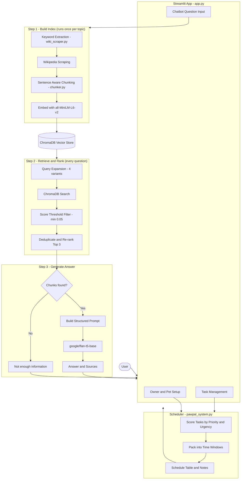

```mermaid
flowchart TD
    User([User]) --> UI

    subgraph UI["Streamlit App - app.py"]
        OwnerForm[Owner and Pet Setup]
        TaskForm[Task Management]
        ChatBox[Chatbot Question Input]
    end

    OwnerForm --> Scheduler
    TaskForm --> Scheduler

    subgraph Scheduler["Scheduler - pawpal_system.py"]
        Score[Score Tasks by Priority and Urgency]
        Pack[Pack into Time Windows]
        SchedOut[Schedule Table and Notes]
        Score --> Pack --> SchedOut
    end

    SchedOut --> UI
    ChatBox --> Step1

    subgraph Step1["Step 1 - Build Index (runs once per topic)"]
        Extract["Keyword Extraction - wiki_scraper.py"]
        Scrape[Wikipedia Scraping]
        Chunk["Sentence Aware Chunking - chunker.py"]
        EmbedStore["Embed with all-MiniLM-L6-v2"]
        Extract --> Scrape --> Chunk --> EmbedStore
    end

    EmbedStore --> ChromaDB[(ChromaDB Vector Store)]

    ChromaDB --> Step2

    subgraph Step2["Step 2 - Retrieve and Rank (every question)"]
        Expand["Query Expansion - 4 variants"]
        Search[ChromaDB Search]
        Filter["Score Threshold Filter - min 0.05"]
        Rerank["Deduplicate and Re-rank Top 3"]
        Expand --> Search --> Filter --> Rerank
    end

    subgraph Step3["Step 3 - Generate Answer"]
        Fallback{"Chunks found?"}
        Prompt[Build Structured Prompt]
        FlanT5["google/flan-t5-base"]
        FinalAnswer[Answer and Sources]
        NoAnswer[Not enough information]
    end

    Rerank --> Fallback
    Fallback -- Yes --> Prompt --> FlanT5 --> FinalAnswer
    Fallback -- No --> NoAnswer

    FinalAnswer --> UI
    NoAnswer --> UI
```
